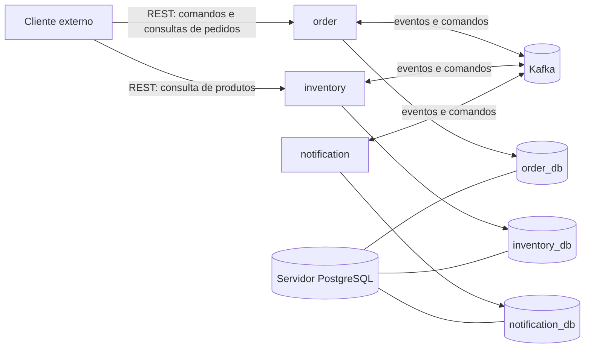
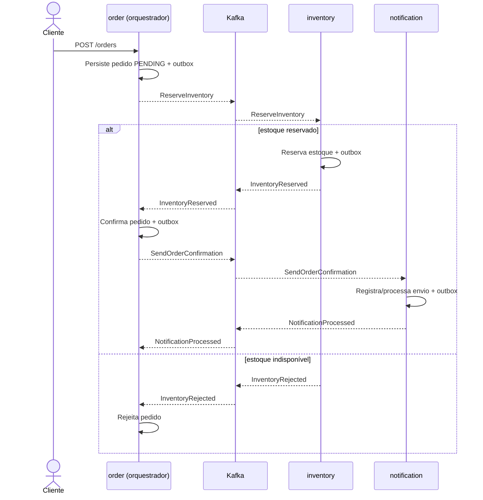
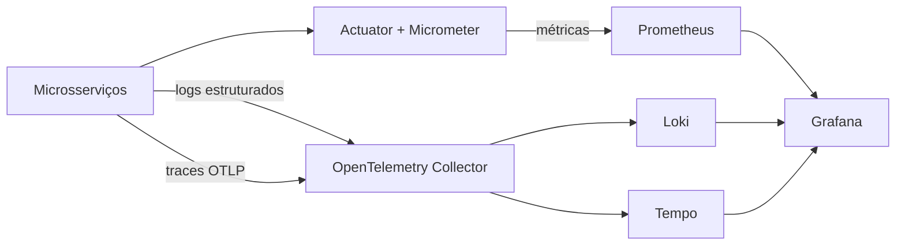

# Arquitetura do Projeto Market

## 1. Objetivo

O **Market** é um projeto de compras composto por três microsserviços:

- **order**: recebe comandos de compra, controla o ciclo de vida do pedido e orquestra a saga da compra;
- **inventory**: mantém produtos e estoque, atende consultas de produtos e participa da reserva ou liberação de estoque;
- **notification**: processa solicitações de notificação decorrentes dos eventos da compra.

O sistema será desenvolvido como um monorepo, com aplicações independentes e implantáveis separadamente. A arquitetura segue princípios **cloud native** e **Kubernetes-first**, sem acoplar o domínio às APIs do Kubernetes.

Esta documentação descreve a arquitetura-alvo inicial. Nem todos os componentes aqui definidos já estão implementados.

## 2. Stack e versões

| Tecnologia | Versão ou escolha |
|---|---|
| Java | 21 |
| Spring Framework | 7.0.8 |
| Spring Boot | 4.0.7 |
| API REST | Spring MVC com `spring-boot-starter-webmvc` |
| Banco de dados | PostgreSQL, um servidor compartilhado com banco e usuário isolados por microsserviço |
| Migrações | Flyway |
| Mensageria | Apache Kafka |
| Resiliência | Resilience4j |
| Operação | Spring Boot Actuator |
| Métricas | Micrometer e Prometheus |
| Logs | Loki |
| Traces | OpenTelemetry, OpenTelemetry Collector e Tempo |
| Visualização | Grafana |
| Testes | JUnit 5, Mockito, AssertJ e Testcontainers |
| Containers | Docker |
| Orquestração | Kubernetes em cluster local Kind |
| CI/CD | GitHub Actions |

No Spring Boot 4, o starter preferencial para aplicações REST baseadas em Spring MVC é o `spring-boot-starter-webmvc`. O antigo `spring-boot-starter-web` não será adotado em novas configurações do projeto.

## 3. Contexto geral



### 3.1 Comunicação externa

As APIs REST serão expostas somente onde houver interação externa:

- **order**: criação e consulta de pedidos e demais operações do ciclo de vida da compra;
- **inventory**: consulta de produtos e de disponibilidade que possa ser apresentada ao cliente.

As APIs usarão JSON sobre HTTP, validação de entrada e códigos HTTP semanticamente adequados. Contratos REST deverão ser documentados com OpenAPI.

A consulta externa de disponibilidade não representa uma reserva. A disponibilidade definitiva será validada pelo `inventory` durante a saga, evitando que uma consulta anterior seja tratada como garantia de estoque.

### 3.2 Comunicação interna

Toda comunicação entre `order`, `inventory` e `notification` será assíncrona por Kafka. Não haverá chamadas REST internas entre esses microsserviços na arquitetura inicial.

Consequências dessa decisão:

- o sistema trabalhará com **consistência eventual**;
- os microsserviços não dependerão da disponibilidade simultânea uns dos outros;
- eventos e comandos precisarão de contratos explícitos e versionados;
- consumidores deverão ser idempotentes;
- falhas serão tratadas com retries controlados e Dead Letter Topics (DLT);
- a chave de particionamento deverá preservar a ordem dos eventos de uma mesma compra, preferencialmente usando `orderId`.

## 4. Responsabilidades dos microsserviços

### 4.1 order

Responsável por:

- receber os comandos externos relacionados a pedidos;
- validar regras do pedido sob sua responsabilidade;
- persistir o pedido e seu histórico de estados;
- iniciar e orquestrar a saga da compra;
- enviar comandos aos participantes por Kafka;
- consumir respostas dos participantes;
- decidir o próximo passo da saga;
- executar compensações quando necessário;
- fornecer consultas REST sobre pedidos.

O `order` será o **orquestrador da saga**, pois é proprietário do processo de negócio e do ciclo de vida da compra.

### 4.2 inventory

Responsável por:

- manter produtos e sua disponibilidade;
- fornecer consultas externas de produtos por REST;
- processar comandos de reserva e liberação de estoque recebidos por Kafka;
- impedir reservas acima da disponibilidade;
- publicar o resultado de cada operação de estoque;
- garantir idempotência no processamento dos comandos.

### 4.3 notification

Responsável por:

- consumir comandos de notificação enviados durante a saga;
- registrar tentativas e o estado de entrega;
- executar o envio pelo canal que vier a ser definido;
- publicar o resultado do processamento quando ele for relevante para a saga;
- tratar retries e falhas permanentes sem bloquear os demais serviços.

O canal efetivo de notificação, como e-mail, SMS ou push, será definido em especificação própria.

## 5. Saga orquestrada

A compra será coordenada por uma **saga orquestrada**, tendo o `order` como orquestrador. Os participantes não decidem o fluxo global; eles executam comandos e informam resultados.

Fluxo inicial de referência:



Os nomes finais dos comandos, eventos, tópicos e estados serão definidos nas especificações funcionais. O diagrama representa a direção arquitetural, não um contrato definitivo.

### 5.1 Compensações

Cada etapa que alterar estado deverá definir sua operação compensatória quando ela for necessária. Por exemplo, se uma etapa posterior à reserva falhar de forma definitiva e a compra não puder continuar, o `order` poderá emitir `ReleaseInventory`.

Uma compensação também é uma operação distribuída e poderá falhar. Portanto, deverá ser:

- idempotente;
- observável;
- repetível com segurança;
- registrada no estado da saga;
- encaminhada para tratamento operacional quando todas as tentativas se esgotarem.

O sucesso ou a falha de uma notificação não deverá, por padrão, cancelar uma compra já confirmada. Essa regra deverá ser confirmada na especificação da funcionalidade.

## 6. Transactional Outbox

O padrão **Transactional Outbox** será usado nos serviços que persistem uma alteração de negócio e precisam publicar uma mensagem no Kafka.

Na mesma transação PostgreSQL, o serviço deverá:

1. alterar o estado do domínio;
2. inserir a mensagem na tabela de outbox;
3. concluir a transação local;
4. publicar posteriormente a mensagem no Kafka;
5. marcar ou remover o registro publicado conforme a política de retenção.

Essa abordagem evita a gravação no banco sem a correspondente intenção durável de publicação. Ela não produz processamento exatamente uma vez em todo o sistema; por isso, os consumidores continuarão obrigatoriamente idempotentes.

A implementação inicial poderá usar um publicador próprio com polling e locking no PostgreSQL. A adoção futura de Change Data Capture, como Debezium, exigirá decisão arquitetural específica.

### 6.1 Envelope das mensagens

Comandos e eventos deverão carregar ao menos:

- `messageId` único;
- `messageType`;
- `schemaVersion`;
- `occurredAt` em UTC;
- `correlationId`;
- `causationId` quando aplicável;
- `orderId` ou outra chave de negócio;
- origem da mensagem;
- payload do contrato.

Eventos descrevem fatos ocorridos e deverão ser nomeados no passado. Comandos expressam uma solicitação e deverão usar linguagem imperativa. Contratos publicados não deverão expor diretamente entidades JPA.

## 7. Persistência e isolamento

Os três microsserviços compartilharão um único servidor PostgreSQL, mantendo **isolamento lógico por banco e usuário**:

- `order` será proprietário exclusivo de `order_db` e usará `order_user`;
- `inventory` será proprietário exclusivo de `inventory_db` e usará `inventory_user`;
- `notification` será proprietário exclusivo de `notification_db` e usará `notification_user`;
- um microsserviço não receberá credenciais nem permissão para acessar o banco dos demais;
- não haverá joins, foreign keys ou transações entre bancos de microsserviços;
- compartilhamento de informação ocorrerá apenas pelos contratos REST externos ou por Kafka internamente.

Cada serviço terá suas próprias credenciais e migrations Flyway. As migrations serão versionadas junto ao serviço e executadas de maneira controlada no processo de implantação.

No ambiente local inicial haverá um único workload PostgreSQL, com Service e armazenamento próprios. O isolamento será lógico, não físico. Essa simplificação reduz o consumo de recursos na máquina local, mas cria um ponto único de falha e não representa por si só uma topologia de produção altamente disponível. A separação futura em instâncias independentes não deverá exigir mudanças no domínio, pois cada serviço continuará proprietário exclusivo de seu banco.

## 8. Organização interna e princípios de design

O código seguirá Clean Code, SOLID e DDD tático leve. Esses princípios orientarão decisões, mas não justificarão complexidade sem benefício concreto.

Uma separação interna de referência é:

```text
domain/          regras e modelos de domínio independentes de framework
application/     casos de uso, portas e coordenação da aplicação
infrastructure/  PostgreSQL, Kafka, clientes e configuração técnica
interfaces/      controllers REST, listeners Kafka e DTOs de entrada/saída
```

Essa estrutura poderá ser organizada por funcionalidade para manter alta coesão. Não é obrigatório criar uma interface para toda classe, nem reproduzir todas as camadas quando o serviço ainda não possuir comportamento que as justifique.

Diretrizes:

- regras de negócio não dependerão de controllers, Kafka, JPA ou Kubernetes;
- DTOs REST, mensagens Kafka e modelos de persistência terão fronteiras explícitas;
- entidades e value objects protegerão invariantes relevantes;
- aggregates serão usados apenas em fronteiras transacionais reais;
- eventos de domínio internos serão distintos de eventos de integração;
- abstrações serão introduzidas por necessidade, não por ritual arquitetural;
- recursos modernos do Java 21, como records, pattern matching e sealed types, serão usados quando melhorarem clareza e segurança.

## 9. Resiliência

O Resilience4j será adotado para integrações síncronas que necessitem de circuit breaker, retry, rate limiter, bulkhead ou timeout. Como a comunicação interna inicial é feita por Kafka, ele não substituirá os mecanismos próprios de resiliência da mensageria.

No Kafka serão definidos:

- quantidade limitada de tentativas;
- backoff adequado ao tipo de falha;
- retry topics quando apropriado;
- DLT para falhas permanentes;
- idempotência por `messageId` ou chave equivalente;
- alertas para crescimento de lag e mensagens em DLT;
- procedimento de diagnóstico e reprocessamento.

Retries não poderão ser infinitos. Erros de contrato ou validação não deverão ser tratados da mesma forma que falhas temporárias de infraestrutura.

## 10. Observabilidade

A observabilidade cobrirá métricas, logs e traces:



Os detalhes do pipeline poderão ser ajustados nos artefatos de infraestrutura, preservando os seguintes objetivos:

- métricas de JVM, HTTP, banco, Kafka e regras críticas de negócio;
- logs estruturados em JSON;
- propagação de `traceId`, `spanId` e `correlationId`;
- tracing distribuído nas operações REST e no fluxo Kafka;
- dashboards por serviço e por jornada da compra;
- alertas para indisponibilidade, latência, taxa de erros, lag, DLT e falhas da outbox;
- cuidado com cardinalidade de labels e ausência de dados pessoais ou segredos nos logs.

O Spring Boot Actuator disponibilizará endpoints operacionais. Apenas os endpoints necessários serão expostos, mesmo durante a fase sem segurança funcional da aplicação.

## 11. Kubernetes-first

O ambiente inicial será um cluster Kubernetes local criado com **Kind**. Os recursos serão descritos inicialmente em arquivos YAML nativos, sem Helm e sem Kustomize.

Artefatos previstos:

- Namespace;
- Deployments dos três microsserviços;
- Services internos;
- ConfigMaps;
- Secrets para desenvolvimento local;
- um servidor PostgreSQL com bancos e usuários isolados por microsserviço;
- Kafka e seus recursos necessários;
- Prometheus, Loki, Tempo, Grafana e OpenTelemetry Collector;
- Jobs ou estratégia equivalente para migrations Flyway, caso se mostre necessária;
- Ingress ou alternativa de acesso local às APIs;
- ServiceAccounts e permissões mínimas quando aplicável.

Cada microsserviço deverá atender aos seguintes requisitos operacionais:

- imagem de container imutável;
- execução como usuário não root;
- configuração externalizada;
- `startupProbe`, `readinessProbe` e `livenessProbe` baseadas no Actuator;
- graceful shutdown e tratamento de `SIGTERM`;
- requests e limits de CPU e memória;
- réplicas stateless sempre que possível;
- compatibilidade com rolling updates;
- dados persistentes fora do filesystem efêmero do container.

Não será utilizado Spring Cloud Kubernetes. Descoberta, configuração e operação usarão primitivas nativas do Kubernetes, como DNS de Services, ConfigMaps, Secrets e probes.

## 12. Docker

Cada microsserviço terá sua própria imagem Docker. As imagens deverão:

- usar runtime compatível com Java 21;
- ter tamanho reduzido e origem conhecida;
- executar com usuário sem privilégios;
- possuir camadas que favoreçam cache de build;
- não conter credenciais nem configurações específicas de ambiente;
- receber identificação da versão e do commit;
- ser verificadas contra vulnerabilidades no pipeline.

O Docker Compose poderá ser usado como conveniência de desenvolvimento, mas os manifests Kubernetes serão a referência do ambiente integrado inicial.

## 13. Testes automatizados

A estratégia de testes incluirá:

- **testes unitários** de domínio e casos de uso com JUnit 5 e AssertJ;
- **Mockito** nas fronteiras em que doubles tragam isolamento útil;
- **testes de integração** com Spring Boot;
- **Testcontainers** para validar integrações reais com PostgreSQL e Kafka;
- testes das migrations Flyway;
- testes das APIs REST;
- testes de serialização, compatibilidade e consumo dos contratos Kafka;
- testes de idempotência, retry, DLT e outbox;
- poucos testes ponta a ponta para as jornadas críticas da compra.

Mocks não substituirão testes reais de PostgreSQL ou Kafka quando o comportamento dessas tecnologias fizer parte do que está sendo validado.

## 14. CI/CD e monorepo

O código permanecerá inicialmente em um monorepo. Cada microsserviço continuará sendo uma unidade independente de build e implantação.

O GitHub Actions deverá executar, conforme a evolução do projeto:

1. detecção dos serviços afetados;
2. compilação e testes;
3. análise estática e verificação de dependências;
4. testes de integração com PostgreSQL e Kafka;
5. construção das imagens;
6. geração de SBOM e scan de vulnerabilidades;
7. publicação das imagens em registry;
8. aplicação dos manifests YAML no cluster de destino;
9. smoke tests e verificação do rollout.

No ambiente Kind local, a automação poderá carregar as imagens diretamente no cluster ou usar um registry local. A estratégia definitiva de registry e promoção entre ambientes será decidida quando houver ambientes além da máquina local.

## 15. Segurança

Autenticação, autorização e o provedor de identidade não serão definidos nem implementados na fase inicial. Segurança funcional será tratada em uma evolução futura e registrada em especificação e decisão arquitetural próprias.

Esse adiamento não autoriza práticas inseguras na infraestrutura. Desde o início deverão ser evitados:

- credenciais em código ou imagens;
- exposição pública desnecessária de bancos, Kafka e endpoints do Actuator;
- execução privilegiada de containers;
- segredos em logs;
- permissões Kubernetes superiores às necessárias.

## 16. Decisões e restrições

Decisões aprovadas:

- Java 21, Spring Framework 7.0.8 e Spring Boot 4.0.7;
- APIs REST externas com Spring MVC;
- comunicação interna exclusivamente por Kafka;
- saga orquestrada pelo `order`;
- Transactional Outbox;
- um servidor PostgreSQL compartilhado, com banco e usuário isolados por microsserviço;
- Flyway para migrations;
- Resilience4j para resiliência síncrona quando aplicável;
- Spring Boot Actuator;
- Prometheus, Loki, Tempo, Grafana e OpenTelemetry Collector;
- Docker e Kubernetes local com Kind;
- manifests Kubernetes em YAML puro inicialmente;
- monorepo com serviços implantáveis independentemente;
- GitHub Actions para CI/CD;
- ausência de Spring Cloud e Spring Cloud Kubernetes;
- segurança funcional adiada para uma fase futura.

## 17. Pontos ainda em aberto

As seguintes decisões serão detalhadas por especificações ou ADRs futuros:

- contratos definitivos das APIs REST;
- catálogo de comandos, eventos e tópicos Kafka;
- formato de serialização e estratégia de schema registry;
- estados completos da saga e suas compensações;
- canal de envio de notificações;
- política de retenção da outbox e das mensagens Kafka;
- estratégia de reprocessamento da DLT;
- topologia e requisitos de alta disponibilidade para produção;
- registry de imagens e promoção entre ambientes;
- autenticação e autorização;
- estratégia futura de empacotamento dos manifests Kubernetes.
