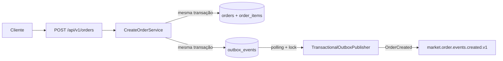

# Kafka e Transactional Outbox do microsserviço Order

## 1. Escopo e estado atual

O microsserviço `order` produz o evento de integração `OrderCreated` depois de persistir um pedido. A intenção de publicação é gravada na Transactional Outbox na mesma transação PostgreSQL do pedido e de seus itens.

O fluxo implementado termina na publicação Kafka. Ainda não existem consumidores, início efetivo da saga, DLT ou reprocessamento automático de eventos terminais.

Este documento é a referência principal para contrato, configuração e garantias do produtor. O ADR registra a decisão e o histórico da migração; o README da infraestrutura registra topologia e provisionamento; o guia do Console cobre navegação e diagnóstico.



## 2. Identificadores oficiais

| Camada | Identificador |
|---|---|
| Tópico Kafka | `market.order.events.created.v1` |
| Propriedade Spring | `market.kafka.topics.order-created-events` |
| Variável de ambiente | `ORDER_CREATED_EVENTS_TOPIC` |
| Binding Java | `KafkaTopicProperties.orderCreatedEvents()` |
| Tipo do evento | `OrderCreated` |
| Versão | `1` |

A decisão de usar um tópico por tipo de evento e o significado da versão estão registrados no [ADR 0001](../../docs/adr/0001-topico-por-tipo-de-evento.md).

## 3. Contrato `OrderCreated` v1

### 3.1 Tópico e particionamento

| Propriedade | Valor local |
|---|---|
| Tópico | `market.order.events.created.v1` |
| Proprietário | `order` |
| Chave Kafka | `orderId` como texto UUID |
| Partições | `3` |
| Fator de replicação | `1` |
| Política de limpeza | `delete` |
| Retenção | `604800000 ms` — 7 dias |
| Formato do valor | JSON UTF-8 sem schema registrado |

O produtor não informa uma partição explicitamente. O Kafka seleciona a partição a partir da chave `orderId`, mantendo os eventos de um mesmo pedido na mesma partição enquanto o número de partições e a estratégia do produtor forem preservados.

### 3.2 Payload

Exemplo completo:

```json
{
  "eventId": "0f8fad5b-d9cb-469f-a165-70867728950e",
  "eventType": "OrderCreated",
  "schemaVersion": 1,
  "correlationId": "7c9e6679-7425-40de-944b-e07fc1f90ae7",
  "orderId": "7c9e6679-7425-40de-944b-e07fc1f90ae7",
  "customerId": "0f52f7d1-f83b-4bbc-a1f4-ecac92cc287a",
  "items": [
    {
      "productId": "6c20b55a-2e09-4473-98a6-411f48a8bb23",
      "quantity": 2
    }
  ],
  "occurredAt": "2026-08-20T18:00:00Z"
}
```

| Campo | Tipo | Semântica |
|---|---|---|
| `eventId` | UUID | Identificador único do evento e da linha de Outbox |
| `eventType` | String | Constante `OrderCreated` |
| `schemaVersion` | Integer | Constante `1` |
| `correlationId` | UUID | Atualmente igual ao `orderId` |
| `orderId` | UUID | Identificador do pedido criado e chave de negócio |
| `customerId` | UUID | Cliente proprietário do pedido |
| `items` | Array | Itens solicitados, obrigatório e não vazio |
| `items[].productId` | UUID | Produto solicitado |
| `items[].quantity` | Integer | Quantidade positiva solicitada |
| `occurredAt` | Instant ISO-8601 | Instante UTC usado na criação do pedido e do evento |

`eventId` e `orderId` são identificadores diferentes. O valor publicado vem do `JSONB` da Outbox convertido para texto; consumidores não devem depender de espaços, indentação ou ordem física das propriedades.

O evento omite deliberadamente `orderNumber` e status, embora o pedido já seja criado como `PENDING`. Nome do produto, preço unitário, subtotal, total e moeda ainda não estão disponíveis e dependem de etapas futuras de catálogo, estoque e precificação.

### 3.3 Headers Kafka

Todos os headers são gravados como bytes UTF-8.

| Header | Valor |
|---|---|
| `eventId` | UUID do evento |
| `eventType` | `OrderCreated` |
| `schemaVersion` | Texto `1` |
| `correlationId` | UUID do pedido |
| `occurredAt` | Instant ISO-8601 em UTC |

Os metadados também aparecem no payload. No código atual, o header `schemaVersion` é definido pelo publicador como `1`; ele não é extraído dinamicamente do payload.

### 3.4 Obrigações dos futuros consumidores

Consumidores deverão:

- assinar explicitamente `market.order.events.created.v1`;
- usar `eventId` para deduplicação durável;
- validar `eventType` e `schemaVersion` antes de processar;
- usar a chave `orderId` quando dependerem da ordem por pedido;
- tolerar reentrega do mesmo evento;
- não depender da ordem textual dos campos JSON;
- tratar um tipo de evento diferente como violação de contrato.

## 4. Atomicidade e garantia de entrega

`CreateOrderService.create()` abre uma transação PostgreSQL. Dentro dela, o adaptador persiste:

1. o pedido;
2. seus itens;
3. o payload `OrderCreated` em `outbox_events` com status `PENDING`.

O pedido não é publicado diretamente durante a requisição HTTP. O scheduler executa posteriormente o publicador, que:

1. seleciona registros `PENDING` elegíveis;
2. ordena por `created_at`;
3. limita pelo tamanho configurado do lote;
4. bloqueia com `FOR UPDATE SKIP LOCKED`;
5. envia cada evento e espera o acknowledgement do Kafka;
6. marca `PUBLISHED` somente depois da confirmação.

A publicação confirmada tem semântica **at-least-once** e permite duplicatas. `acks=all` e a idempotência do produtor protegem contra parte das duplicações do cliente Kafka, mas não criam uma transação distribuída entre PostgreSQL e Kafka. Se o Kafka confirmar e o commit PostgreSQL falhar antes de persistir `PUBLISHED`, o evento poderá ser enviado novamente. A entrega automática não é ilimitadamente garantida: depois de `max-attempts`, o registro fica `FAILED` e exige intervenção.

`publishBatch()` executa o lote inteiro em uma única transação PostgreSQL. Os locks permanecem ativos enquanto os envios Kafka síncronos são aguardados, e as mudanças para `PUBLISHED` ou retry só se tornam duráveis no commit ao final do lote. Uma falha Kafka capturada em um item não impede o processamento dos itens seguintes; uma falha posterior da transação pode reverter estados já atualizados e provocar reentrega de mensagens que o Kafka confirmou.

## 5. Estados e retry da Outbox

| Estado | Significado atual |
|---|---|
| `PENDING` | Aguardando primeira tentativa ou retry elegível |
| `PUBLISHED` | Kafka confirmou e a confirmação foi persistida |
| `FAILED` | Limite de tentativas atingido; exige intervenção |
| `PROCESSING` | Permitido pelo schema, mas não utilizado pelo publicador atual |

Em caso de sucesso, `attempts` também é incrementado; portanto, o campo representa o total de tentativas, não apenas falhas.

Em caso de erro:

- `attempts` é incrementado;
- `last_error` recebe até 1.000 caracteres;
- uma tentativa não terminal mantém o estado `PENDING` e define `next_attempt_at`;
- ao atingir `max-attempts`, o estado passa para `FAILED` e não existe novo agendamento automático.

O retry usa atraso fixo. Não há backoff exponencial, jitter, DLT, replay automático de `FAILED` ou política implementada de limpeza para registros `PUBLISHED` e `FAILED`.

## 6. Configuração do `order`

### 6.1 Kafka

| Propriedade | Variável de ambiente | Default |
|---|---|---|
| `spring.kafka.bootstrap-servers` | `KAFKA_BOOTSTRAP_SERVERS` | `localhost:19092` |
| `market.kafka.topics.order-created-events` | `ORDER_CREATED_EVENTS_TOPIC` | `market.order.events.created.v1` |

Configuração do produtor:

| Propriedade | Valor |
|---|---|
| `acks` | `all` |
| `enable.idempotence` | `true` |
| `max.in.flight.requests.per.connection` | `5` |

### 6.2 Publicador da Outbox

| Propriedade | Variável de ambiente | Default |
|---|---|---|
| `market.outbox.publisher.enabled` | `OUTBOX_PUBLISHER_ENABLED` | `true` |
| `market.outbox.publisher.fixed-delay` | `OUTBOX_PUBLISHER_FIXED_DELAY` | `1000 ms` |
| `market.outbox.publisher.batch-size` | `OUTBOX_PUBLISHER_BATCH_SIZE` | `50` |
| `market.outbox.publisher.max-attempts` | `OUTBOX_PUBLISHER_MAX_ATTEMPTS` | `5` |
| `market.outbox.publisher.retry-delay` | `OUTBOX_PUBLISHER_RETRY_DELAY` | `5s` |
| `market.outbox.publisher.send-timeout` | `OUTBOX_PUBLISHER_SEND_TIMEOUT` | `10s` |

Com os defaults, a quinta falha torna o registro terminalmente `FAILED`.

## 7. Provisionamento local

Na raiz do monorepo:

```bash
docker compose -f compose.yaml up -d
docker compose -f compose.yaml run --rm kafka-init
```

Verificar os tópicos:

```bash
docker compose -f compose.yaml exec -T redpanda \
  rpk topic list --brokers redpanda:9092
```

Descrever o tópico:

```bash
docker compose -f compose.yaml exec -T redpanda \
  rpk topic describe market.order.events.created.v1 --brokers redpanda:9092
```

`infrastructure/kafka/topics.yaml` é o catálogo declarativo versionado. O provisionador local `create-topics.sh` ainda repete explicitamente o nome e as propriedades do tópico; ele não interpreta o YAML.

O script é idempotente apenas para criação:

- cria o tópico quando ele não existe;
- descreve o tópico quando ele já existe;
- não renomeia tópicos;
- não exclui tópicos;
- não reconcilia mudanças de partições, retenção ou outras configurações.

Enquanto o script não for gerado a partir do catálogo, alterações deverão manter `topics.yaml`, `create-topics.sh`, a configuração do produtor e os testes sincronizados.

## 8. Registro do refactor

Em 20 de agosto de 2026, o piloto adotou os quatro identificadores oficiais da seção 2. Não houve alias, fallback para o identificador anterior nem publicação dupla.

O tópico atual foi provisionado no Redpanda local com três partições, fator de replicação `1` e retenção de sete dias. O tópico genérico anterior foi removido. Essa exclusão foi destrutiva e eventuais mensagens antigas não são recuperáveis pelo broker.

Não havia consumidor implementado para migrar. Código, testes, infraestrutura, documentação e artefatos gerados foram atualizados, e uma busca integral confirmou a ausência de referências obsoletas.

## 9. Verificação automatizada

A suíte completa possui 23 testes e foi executada com sucesso após o refactor.

| Teste | Evidência fornecida |
|---|---|
| `TransactionalOutboxPublisherTest` | Tópico, chave, valor, `eventId`, sucesso e encaminhamento de falha para retry |
| `OutboxKafkaIntegrationTests` | PostgreSQL e Kafka reais, publicação, consumo, payload essencial, headers principais e estado `PUBLISHED`; o broker de teste permite criação automática e não valida `kafka-init` |
| `OrderApplicationTests` | Flyway V4, persistência do pedido e evento `PENDING` na Outbox |

Lacunas de teste conhecidas:

- transição terminal para `FAILED` não possui teste direto;
- persistência de `next_attempt_at`, `last_error` e dos incrementos de retry não possui teste direto do repository;
- todos os headers não são validados em conjunto;
- topologia e retenção do tópico não são verificadas por teste automatizado;
- o script `kafka-init` foi validado operacionalmente, mas não possui teste automatizado;
- não há teste de rollback que demonstre pedido, itens e Outbox revertendo juntos;
- não há consumidor de negócio nem teste de deduplicação, DLT ou replay.

## 10. Limitações e próximos passos

- o publicador envia todos os registros elegíveis para o tópico de criação sem rotear por `eventType`; até existir roteamento, somente `OrderCreated` pode ser gravado como evento publicável;
- não existe consumidor no `inventory`;
- o Redpanda local oferece Schema Registry, mas `OrderCreated` não possui schema registrado e o produtor não o utiliza;
- não existem DLT, retry topics ou ferramenta de reprocessamento;
- não há métricas ou alertas específicos da Outbox;
- o contrato v1 ainda não possui `causationId` nem origem explícita;
- a política de retenção e limpeza da tabela de Outbox ainda não foi definida.

O próximo passo funcional continua sendo especificar o consumo idempotente pelo `inventory` e o início da saga orquestrada.

## 11. Referências

- [Especificação do `order`](spec.md)
- [Plano do `order`](plan.md)
- [Infraestrutura Kafka](../../infrastructure/kafka/README.md)
- [Uso do Redpanda Console](../../infrastructure/kafka/redpanda-console.md)
- [ADR 0001](../../docs/adr/0001-topico-por-tipo-de-evento.md)
