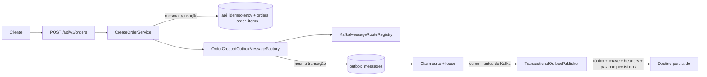

# Kafka e Transactional Outbox do microsserviço Order

## 1. Escopo e estado atual

O microsserviço `order` produz `OrderCreated` v1 depois de persistir um pedido. Pedido, itens, claim HTTP idempotente e intenção de publicação são gravados na mesma transação PostgreSQL.

A Outbox está no schema Flyway V6 e pode transportar comandos e eventos para rotas diferentes. A rota é resolvida antes da persistência; o publisher envia o tópico, a chave, os headers e o payload armazenados sem inferir ou reconstruir o contrato.

O fluxo de negócio implementado ainda termina na publicação de `OrderCreated`. Não existem consumidor, Inbox, estado de saga, DLT ou reprocessamento automático de mensagens terminais. A estrutura do envelope comum existe, mas nenhum comando da saga é produzido neste incremento.



Este documento é a referência operacional do produtor. As decisões estão nos ADRs 0001 e 0003; o README da infraestrutura descreve provisionamento, e o guia do Console descreve inspeção local.

## 2. Identificadores oficiais de `OrderCreated` v1

| Camada | Identificador |
|---|---|
| Tópico Kafka | `market.order.events.created.v1` |
| Propriedade Spring | `market.kafka.topics.order-created-events` |
| Variável de ambiente | `ORDER_CREATED_EVENTS_TOPIC` |
| Binding Java | `KafkaTopicProperties.orderCreatedEvents()` |
| Tipo | `OrderCreated` |
| Categoria | `EVENT` |
| Versão | `1` |

A decisão de um tópico por evento está no [ADR 0001](../../docs/adr/0001-topico-por-tipo-de-evento.md). Envelope, roteamento e lease estão no [ADR 0003](../../docs/adr/0003-envelope-roteamento-e-lease-da-outbox.md).

## 3. Contrato legado `OrderCreated` v1

### 3.1 Tópico e particionamento

| Propriedade | Valor local |
|---|---|
| Tópico | `market.order.events.created.v1` |
| Proprietário | `order` |
| Chave Kafka | `orderId` como texto UUID |
| Partições | `3` |
| Fator de replicação | `1` |
| Política de limpeza | `delete` |
| Retenção | `604800000 ms` — 7 dias |
| Formato do valor | JSON UTF-8 sem schema registrado |

O produtor não escolhe uma partição numericamente. O Kafka a calcula a partir de `orderId`, preservando afinidade enquanto o número de partições e a estratégia do produtor forem mantidos.

### 3.2 Payload

```json
{
  "eventId": "0f8fad5b-d9cb-469f-a165-70867728950e",
  "eventType": "OrderCreated",
  "schemaVersion": 1,
  "correlationId": "7c9e6679-7425-40de-944b-e07fc1f90ae7",
  "orderId": "7c9e6679-7425-40de-944b-e07fc1f90ae7",
  "customerId": "0f52f7d1-f83b-4bbc-a1f4-ecac92cc287a",
  "items": [
    {
      "productId": "6c20b55a-2e09-4473-98a6-411f48a8bb23",
      "quantity": 2
    }
  ],
  "occurredAt": "2026-08-20T18:00:00Z"
}
```

| Campo | Tipo | Semântica |
|---|---|---|
| `eventId` | UUID | Identificador do evento; corresponde a `message_id` na Outbox V6 |
| `eventType` | String | Constante `OrderCreated` |
| `schemaVersion` | Integer | Constante `1` |
| `correlationId` | UUID | Igual ao `orderId` neste contrato legado |
| `orderId` | UUID | Pedido criado e chave de negócio |
| `customerId` | UUID | Cliente proprietário do pedido |
| `items` | Array | Obrigatório e não vazio |
| `items[].productId` | UUID | Produto solicitado |
| `items[].quantity` | Integer | Quantidade positiva |
| `occurredAt` | Instant ISO-8601 | Instante UTC comum ao pedido e ao evento |

O evento omite `orderNumber`, status, nome, preço, subtotal, total e moeda. Consumidores não podem depender de espaços, indentação ou ordem textual das propriedades JSON.

### 3.3 Headers

Todos os valores são texto UTF-8.

| Header | Valor |
|---|---|
| `eventId` | UUID do evento |
| `eventType` | `OrderCreated` |
| `schemaVersion` | `1` |
| `correlationId` | UUID do pedido |
| `occurredAt` | Instant ISO-8601 em UTC |

A factory persiste os cinco headers com a intenção de publicação. O publisher apenas os converte para bytes UTF-8. Ele não fixa `schemaVersion`, não monta headers e não reserializa o payload.

### 3.4 Compatibilidade

`OrderCreated` v1 permanece deliberadamente fora do envelope comum. Ele não recebe `messageId`, `messageType`, `source`, `causationId` ou `payload` aninhado. Essa mudança exigiria `OrderCreated` v2.

Consumidores desse contrato deverão:

- deduplicar por `eventId`;
- validar `eventType` e `schemaVersion`;
- tolerar redelivery;
- usar `orderId` quando dependerem da afinidade por pedido;
- tolerar campos aditivos desconhecidos;
- rejeitar um tipo incompatível como violação de contrato.

## 4. Envelope comum dos contratos novos

```json
{
  "messageId": "11111111-1111-1111-1111-111111111111",
  "messageType": "ReserveInventory",
  "schemaVersion": 1,
  "occurredAt": "2026-08-20T20:15:30.123456Z",
  "source": "order",
  "correlationId": "22222222-2222-2222-2222-222222222222",
  "causationId": "33333333-3333-3333-3333-333333333333",
  "orderId": "44444444-4444-4444-4444-444444444444",
  "payload": {}
}
```

| Campo | Regra |
|---|---|
| `messageId` | UUID obrigatório da intenção de entrega |
| `messageType` | Texto obrigatório, não vazio, com até 100 caracteres |
| `schemaVersion` | Inteiro positivo |
| `occurredAt` | `Instant` obrigatório em UTC |
| `source` | Corresponde a `[a-z][a-z0-9-]{0,99}` |
| `correlationId` | UUID obrigatório da jornada |
| `causationId` | UUID da mensagem causadora; pode ser nulo em uma raiz |
| `orderId` | UUID obrigatório e chave Kafka dos contratos da saga |
| `payload` | Objeto específico, obrigatório e validado pelo contrato |

`MessageContract` identifica a rota pela tripla exata `category`, `messageType` e `schemaVersion`. A categoria é `COMMAND` ou `EVENT` e pertence aos metadados da Outbox, não ao envelope publicado.

`messageId` permanece igual em retry ou redelivery da mesma linha. `operationId`, quando o contrato produzir um efeito idempotente, pertence ao payload. Uma nova mensagem para a mesma operação pode ter outro `messageId`, mas conserva o `operationId`.

O código já fornece `MessageEnvelope`, `MessageContract` e suas validações. Ainda não existe um `ReserveInventory` produtivo; esse nome aparece apenas como exemplo contratual. A única rota de negócio registrada é `OrderCreated` v1.

## 5. Roteamento e modelo persistente V6

### 5.1 Resolução da rota

`KafkaMessageRouteRegistry` recebe um `MessageContract` completo e devolve uma rota somente quando a tripla foi registrada explicitamente. Não existe default, wildcard nem fallback.

Para `OrderCreated`:

1. `OrderCreatedOutboxMessageFactory` valida o contrato;
2. consulta o registry;
3. serializa o payload legado uma vez;
4. monta os cinco headers;
5. define `orderId` como chave;
6. cria `OutboxMessage` com todos os dados finais;
7. `OrderCreatedOutboxWriter` persiste a mensagem dentro da transação da criação do pedido.

O método `append` do writer usa propagação `MANDATORY`: uma chamada sem transação externa ativa falha em vez de produzir uma gravação independente do pedido.

O publisher não depende de `KafkaTopicProperties`: a configuração é resolvida antes do insert e o destino persistido torna-se parte da intenção durável.

### 5.2 Tabela `outbox_messages`

| Coluna | Semântica |
|---|---|
| `message_id` | Identidade da mensagem e chave primária |
| `aggregate_id`, `aggregate_type` | Agregado proprietário da alteração |
| `message_category` | `COMMAND` ou `EVENT` |
| `message_type`, `schema_version` | Contrato versionado |
| `source` | Bounded context produtor |
| `destination_topic` | Tópico físico resolvido no insert |
| `partition_key` | Chave Kafka final |
| `correlation_id`, `causation_id` | Jornada e causa; a causa pode ser nula |
| `headers` | Objeto `JSONB` com nomes não vazios e valores string |
| `payload` | `TEXT` que deve ser um objeto JSON válido |
| `status` | `PENDING`, `PROCESSING`, `PUBLISHED` ou `FAILED` |
| `attempts` | Quantidade de claims realizados |
| `next_attempt_at` | Elegibilidade de um retry conhecido |
| `last_error` | Erro sanitizado com até 1.000 caracteres |
| `lease_id`, `lease_until` | Propriedade e expiração do processamento |
| `occurred_at` | Instante de negócio da mensagem |
| `created_at`, `published_at` | Instantes operacionais definidos pelo relógio PostgreSQL |

Quando `status='PROCESSING'`, `lease_id` e `lease_until` são obrigatórios. Nos demais estados, ambos devem ser nulos.

### 5.3 Migração de V5 para V6

V6:

- aceita exatamente o payload mínimo antigo, sem `eventType`, `schemaVersion` e `correlationId`, ou o payload flat completo atual;
- exige que `eventId`, `orderId` e `occurredAt` correspondam às colunas e, no formato completo, que os três metadados adicionais sejam coerentes;
- aborta integralmente se encontrar presença parcial desses metadados, valor divergente ou outro contrato;
- renomeia `outbox_events` para `outbox_messages`;
- renomeia `id` para `message_id` e `event_type` para `message_type`;
- converte o payload de `JSONB` para `TEXT` validado como objeto JSON;
- adiciona contrato, origem, rota, chave, correlação, headers e lease;
- deriva rota e headers das colunas e do agregado, como fazia o publisher antigo;
- preserva o payload sem acrescentar os campos ausentes, além de status, tentativas, reagendamento, erro e timestamps;
- preserva estados terminais;
- transforma uma linha legada `PROCESSING` em uma lease imediatamente recuperável;
- recria os índices de elegibilidade e lease.

O backfill usa `market.order.events.created.v1`, o nome canônico do contrato. Uma instalação que tenha usado outro `ORDER_CREATED_EVENTS_TOPIC` precisa reconciliar todas as linhas legadas antes da V6, sobretudo `PENDING`, `PROCESSING` e qualquer `FAILED` que possa ser reaberta; caso contrário, até o histórico publicado receberá o destino canônico como metadado. O ambiente local usa o nome canônico.

O upgrade não aceita instâncias V5 e V6 executando ao mesmo tempo. Antes da migration, todas as instâncias V5 devem ser paradas e seus trabalhos drenados, pois elas ainda acessam `outbox_events`; somente depois da V6 a aplicação nova, que acessa `outbox_messages`, pode iniciar. O piloto aceita essa parada coordenada.

Em 20/08/2026, o upgrade do `order_db` local de V5 para V6 foi executado com duas linhas já `PUBLISHED`. As duas permaneceram publicadas, conservaram seus payloads e receberam o tópico canônico e os cinco headers completos.

## 6. Atomicidade e garantia de entrega

### 6.1 Criação do pedido

`CreateOrderService.create()` valida e monta pedido, evento e fingerprint antes da transação. `PostgresOrderCreationAdapter.createOrReplay()` abre a fronteira transacional. Para uma criação nova, confirma ou reverte em conjunto:

1. claim e snapshot de resposta em `api_idempotency`;
2. pedido;
3. itens;
4. `OrderCreated` em `outbox_messages` com status `PENDING`.

Replay HTTP válido não cria nova linha de Outbox.

`OrderCreatedOutboxWriter.append` usa `Propagation.MANDATORY`, tornando essa fronteira uma pré-condição executável: o writer não abre uma transação independente nem permite o insert fora da transação de criação.

### 6.2 Claim curto e envio sequencial

Cada ciclo agendado processa sequencialmente no máximo `batch-size` mensagens. Para cada posição:

1. `claimNext()` abre uma transação curta;
2. marca como `FAILED` claims esgotados e já expirados;
3. seleciona uma linha `PENDING` elegível ou `PROCESSING` com lease expirada;
4. usa `FOR UPDATE SKIP LOCKED` e limita a uma linha;
5. muda para `PROCESSING`, incrementa `attempts`, limpa `next_attempt_at` e cria nova lease;
6. confirma a transação;
7. publica fora da transação PostgreSQL;
8. aguarda o acknowledgement Kafka de forma síncrona;
9. grava sucesso ou falha somente com o mesmo `lease_id`.

`created_at`, elegibilidade, `lease_until`, `next_attempt_at` e `published_at` usam `CURRENT_TIMESTAMP` do PostgreSQL. Isso evita arbitrar leases com relógios locais divergentes entre instâncias. `occurred_at` continua vindo do contrato de negócio.

Uma falha conhecida é persistida e não impede o processamento da próxima mensagem elegível. Uma interrupção restaura a flag da thread e encerra o lote atual.

### 6.3 At-least-once

`acks=all` e a idempotência do producer reduzem duplicatas causadas pelo cliente Kafka, mas não criam uma transação distribuída.

Se o Kafka confirmar e o processo cair antes de persistir `PUBLISHED`, a lease expira e outro claim pode publicar a mesma mensagem. Se um proprietário antigo tentar atualizar depois de outra execução assumir a linha, o `lease_id` diferente impede a sobrescrita.

A garantia continua sendo **at-least-once**. Consumidores novos deduplicam por `messageId`; consumidores de `OrderCreated` v1, por `eventId`.

## 7. Estados, lease e retry

| Estado | Significado |
|---|---|
| `PENDING` | Aguarda primeira tentativa ou `next_attempt_at` |
| `PROCESSING` | Claim ativo protegido por `lease_id` e `lease_until` |
| `PUBLISHED` | Kafka confirmou e a confirmação foi persistida |
| `FAILED` | Orçamento de claims esgotado; exige intervenção |

`attempts` é incrementado no claim, antes da chamada Kafka. Portanto, inclui sucesso, falha conhecida, timeout e claim interrompido por crash. Se a última lease permitida expirar, a linha passa para `FAILED` sem ser reivindicada novamente.

Em falha conhecida:

- `last_error` recebe a causa raiz abreviada;
- uma tentativa não terminal volta para `PENDING` e recebe `next_attempt_at`;
- a tentativa terminal passa para `FAILED` sem novo agendamento;
- lease e identificador do proprietário são limpos.

O retry usa atraso fixo. Não existem backoff exponencial, jitter, DLT, replay automático de `FAILED` ou limpeza automática de linhas terminais.

## 8. Configuração do `order`

### 8.1 Kafka

| Propriedade | Variável de ambiente | Default |
|---|---|---|
| `spring.kafka.bootstrap-servers` | `KAFKA_BOOTSTRAP_SERVERS` | `localhost:19092` |
| `market.kafka.topics.order-created-events` | `ORDER_CREATED_EVENTS_TOPIC` | `market.order.events.created.v1` |
| `spring.kafka.producer.properties.max.block.ms` | `KAFKA_PRODUCER_MAX_BLOCK_MS` | `5000 ms` |

| Propriedade do producer | Valor |
|---|---|
| `acks` | `all` |
| `enable.idempotence` | `true` |
| `max.in.flight.requests.per.connection` | `5` |

### 8.2 Publisher

| Propriedade | Variável de ambiente | Default |
|---|---|---|
| `market.outbox.publisher.enabled` | `OUTBOX_PUBLISHER_ENABLED` | `true` |
| `market.outbox.publisher.fixed-delay` | `OUTBOX_PUBLISHER_FIXED_DELAY` | `1000 ms` |
| `market.outbox.publisher.batch-size` | `OUTBOX_PUBLISHER_BATCH_SIZE` | `50` |
| `market.outbox.publisher.max-attempts` | `OUTBOX_PUBLISHER_MAX_ATTEMPTS` | `5` |
| `market.outbox.publisher.retry-delay` | `OUTBOX_PUBLISHER_RETRY_DELAY` | `5s` |
| `market.outbox.publisher.send-timeout` | `OUTBOX_PUBLISHER_SEND_TIMEOUT` | `10s` |
| `market.outbox.publisher.lease-duration` | `OUTBOX_PUBLISHER_LEASE_DURATION` | `30s` |
| `market.outbox.publisher.kafka-max-block-milliseconds` | `KAFKA_PRODUCER_MAX_BLOCK_MS` | `5000 ms` |

A lease deve ser estritamente maior que:

```text
send-timeout + max.block.ms + margem de segurança de 5s
```

Com os defaults, o orçamento mínimo é `20s` e a lease é `30s`. A aplicação falha na configuração quando essa regra não é satisfeita.

O scheduler possui um worker por processo e o publisher não introduz paralelismo em Java.

## 9. Provisionamento local

Na raiz do monorepo:

```bash
docker compose -f compose.yaml up -d
docker compose -f compose.yaml run --rm kafka-init
```

Verificar os tópicos:

```bash
docker compose -f compose.yaml exec -T redpanda \
  rpk topic list --brokers redpanda:9092
```

Descrever o tópico:

```bash
docker compose -f compose.yaml exec -T redpanda \
  rpk topic describe market.order.events.created.v1 --brokers redpanda:9092
```

`infrastructure/kafka/topics.yaml` é o catálogo declarativo. O provisionador local repete explicitamente os valores e ainda não interpreta o YAML. Ele cria ou descreve, mas não renomeia, exclui nem reconcilia configurações.

O tópico de teste `market.test.commands.routing.v1` não pertence ao catálogo e é criado apenas pelo broker descartável do teste integrado. Nenhum tópico novo da saga foi provisionado.

## 10. Verificação automatizada

| Teste | Evidência |
|---|---|
| `MessageEnvelopeTest` | Campos, serialização e validações essenciais do envelope |
| `OrderCreatedOutboxMessageFactoryTest` | Wire contract legado, rota configurada e rejeição de contrato sem rota |
| `OutboxMigrationTests` | Upgrade V5→V6, backfill, estados terminais, recuperação de `PROCESSING` e preflight abortando contrato desconhecido |
| `OutboxMessageRepositoryTests` | Claim, publicação, retry, falha terminal, lease expirada, proteção do proprietário e headers textuais |
| `OutboxPublisherPropertiesTest` | Lease maior que o orçamento Kafka completo |
| `TransactionalOutboxPublisherTest` | Rota e conteúdo persistidos, continuidade após falha, interrupção, limite e perda de lease |
| `OutboxKafkaIntegrationTests` | PostgreSQL e Kafka reais, replay sem duplicação, contrato legado e envelope enviado ao destino persistido |
| `OrderApplicationTests` | Flyway V6, atomicidade com pedido e idempotência HTTP |

Em 20/08/2026, `./mvnw clean test` executou 73 testes, com zero falhas, zero erros e zero testes ignorados.

Lacunas conhecidas:

- não existe teste concorrente com duas instâncias reais do publisher;
- `last_error` ainda não possui asserção direta de persistência no repository;
- topologia, retenção e `kafka-init` não possuem teste automatizado;
- não existem consumidor de negócio, Inbox, deduplicação, DLT ou replay;
- não existe política implementada de retenção da tabela.

## 11. Limitações e próximo passo

- somente `OrderCreated` v1 possui rota produtiva;
- o envelope comum está implementado, mas ainda não é emitido por um caso de uso;
- `inventory` ainda não consome mensagens;
- o Redpanda local oferece Schema Registry, mas `OrderCreated` e o envelope comum ainda não possuem schema registrado nem usam esse recurso;
- `FAILED` exige intervenção manual;
- não há métricas ou alertas específicos da Outbox;
- o contrato legado não possui `causationId` nem `source` no payload.

O próximo incremento é adicionar Inbox, estado persistente e histórico da saga no `order`. Somente depois disso `ReserveInventory` deve ser definido, provisionado e persistido atomicamente com o início da saga.

## 12. Referências

- [ADR 0001 — Tópico por tipo de evento](../../docs/adr/0001-topico-por-tipo-de-evento.md)
- [ADR 0003 — Envelope, roteamento e lease](../../docs/adr/0003-envelope-roteamento-e-lease-da-outbox.md)
- [Especificação do `order`](spec.md)
- [Plano do `order`](plan.md)
- [Infraestrutura Kafka](../../infrastructure/kafka/README.md)
- [Redpanda Console](../../infrastructure/kafka/redpanda-console.md)
